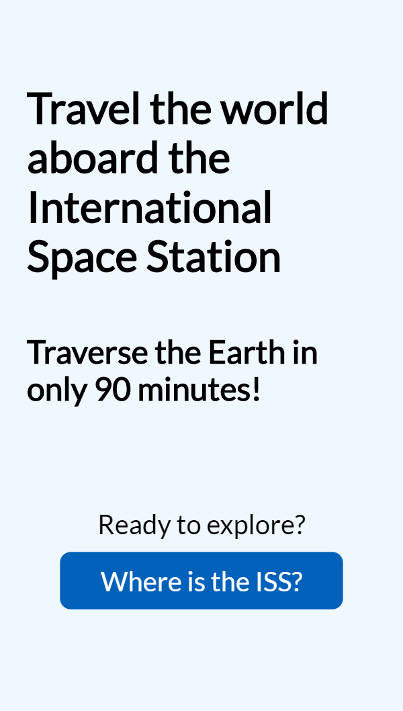
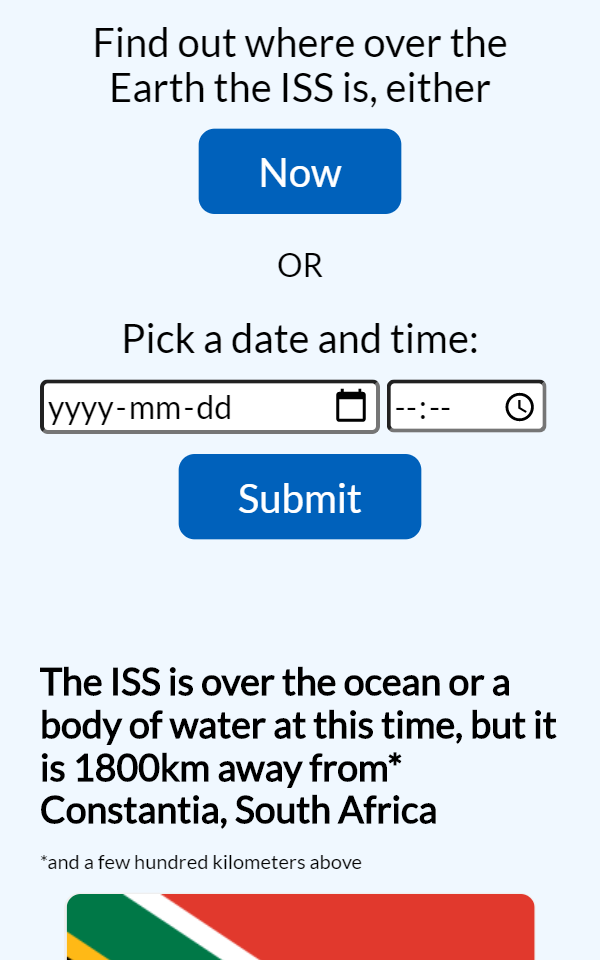
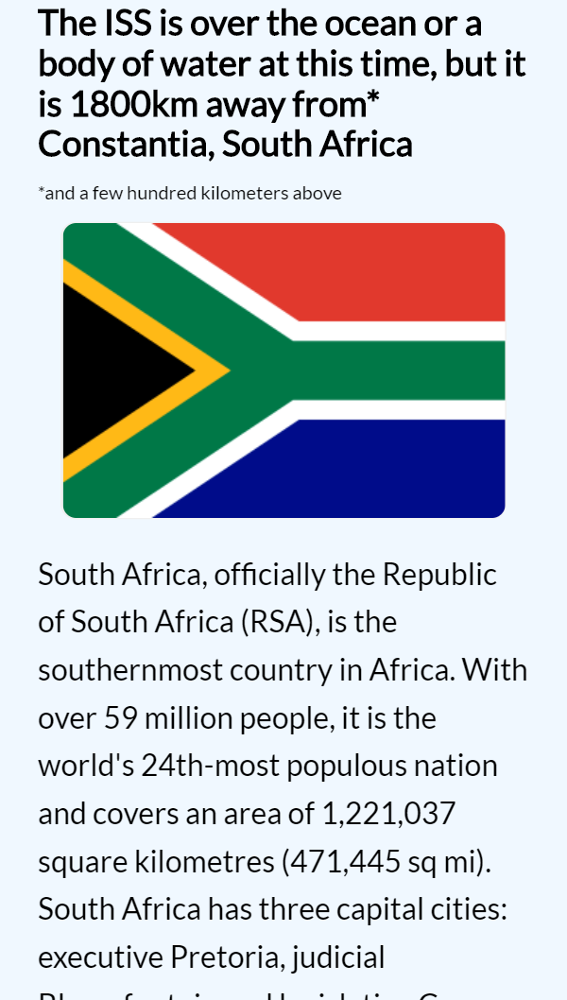

# ISS-Locator.io

Ever wondered where the International Space Station was at that exact moment? How about on your birthday, past or future? 

This app allows users to see the nearest city and country to the coordinates of the ISS at any moment (after the launch of the ISS in 1998). Additionally, users may learn about the nearest country via a short description pulled from Wikipedia.org

## Screenshots
Landing Page:

Results Page:

## Built with

* HTML
* CSS
* JavaScript
* jQuery

## Demo
- [GitHub Pages site](https://jacobscottdale.github.io/iss-locator.io/)
